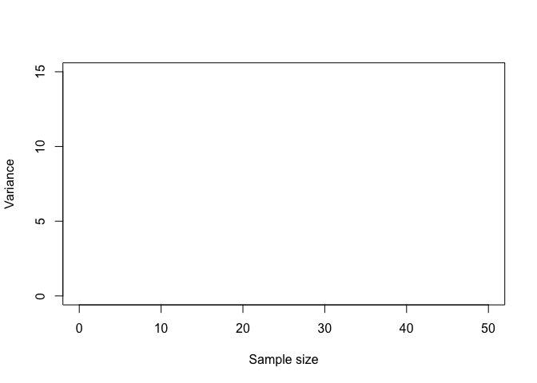
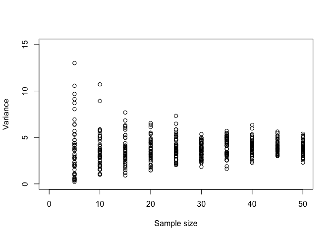
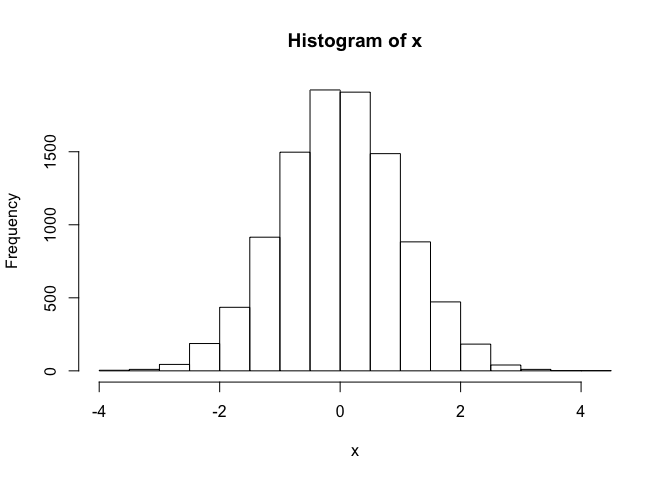
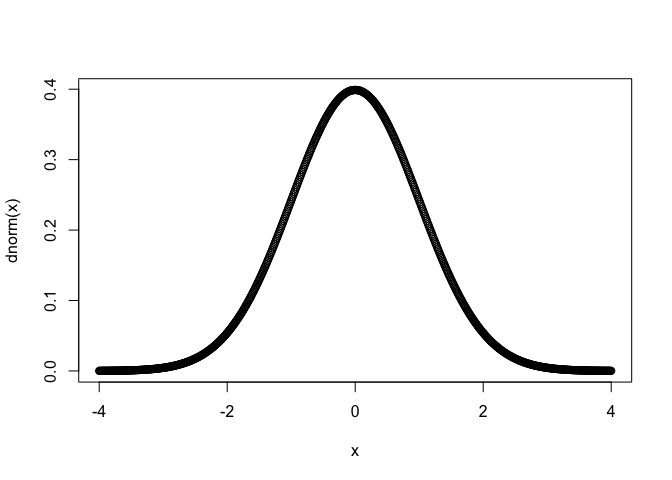
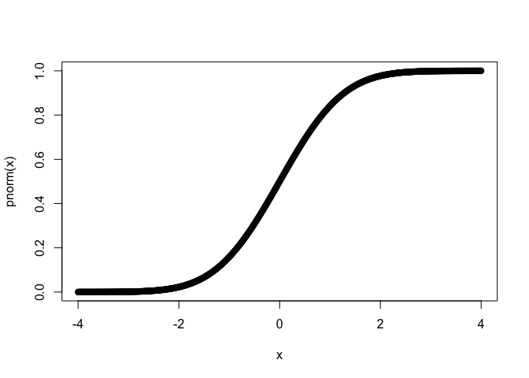
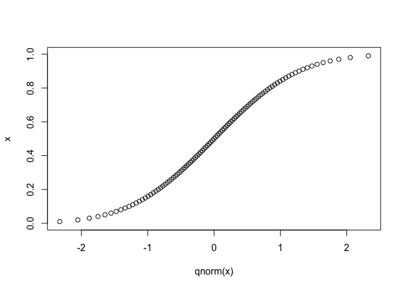

Module 7 - Statistics Fundamentals - Central Tendency and Variance
================

Objectives
==========

> The objective of this module to introduce the fundamental concepts of central tendency and variance, which are crucial for describing data and for statistical hypothesis testing.

Preliminaries
-------------

-   GO TO: `https://github.com/difiore/ADA2016`, select the `.csv` version of the *KamilarAndCooperData* file, then press the `RAW` button, highlight, and copy the text to a text editor and save it locally.

Terms
-----

-   **Population** = includes **all** of the elements from a set of data (e.g., all of the gorillas in the world) = N
-   **Sample** = one or more observations from a population (e.g., the set of gorillas living in Rwanda, the set of gorilla skeletons found in a museum) = n
-   **Parameter** = a measurable characteristic of a population (e.g., the mean value of the femur length of all gorillas)
-   **Statistic** = a measureable characteristic about a sample (e.g., the mean femur length of gorilla femurs found at the American Museum of Natural History)

Describing Sets of Observations or Measurements
-----------------------------------------------

It is important for us to be able to describe the general characteristics of a set of observations or measurements about a population or a sample, and two common ways are to calculate some measure of central tendency and some measure of spread.

### Measures of Central Tendency

-   **Mode** = most common measurement of values observed
-   **Median** = middle value in a rank ordered series of values
-   **Mean** = the sum of measured values divided by **n** = the *average* or the *arithemetic mean*

These measures are relevant to summarizing observations about processes that additive.

-   **Harmonic mean** = the reciprocal of the average of the reciprocals of a set of values
-   **Geometric mean** = a measure of central tendency for processes that are multiplicative rather than additive = the nth root of the product of the values (for the mathematically inclindes, it also = the antilog of the averaged log values).

#### CHALLENGE 1

Given a vector, x &lt;- c(1,2,3,4,5,6,7,8,9,10,100,1000) - Write a function to determine the geometric mean of the values in a vector. Remember the general form for functions is:

*function name* &lt;- function(*arguments to pass*){*code to run*}

``` r
> x <- c(1, 2, 3, 4, 5, 6, 7, 8, 9, 10, 100, 1000)
> gm1 <- function(x) {
+     prod(x)^(1/length(x))
+ }
> gm1(x)
```

    [1] 9.189959

``` r
> gm2 <- function(x) {
+     exp(mean(log(x)))
+ }
> gm2(x)
```

    [1] 9.189959

-   What happens if you have NAs or zeros or negative numbers in the vector? **HINT:** the argument `na.rm = TRUE` and the function `na.omit()` may help you write more generic functions.

Measures of Spread
------------------

A measure of spread or variability in a dataset is the one of the most important summary statistics to calculate. The RANGE (min to max) is one measure of spread as is the INTERQUARTILE range (25th to 75th quartile). As we've seen, these are returned by the `summary()` function.

We commonly characterize spread, however, in terms of the **deviation of values from the mean**.

***sum of squares*** = the sum of the squared deviations of a set of values from the mean

#### CHALLENGE 2

-   Write a function to calculate the sum of squares for a vector

``` r
> ss1 <- function(x) {
+     sum((x - mean(x))^2)
+ }
> 
> ss1(x)
```

    [1] 899216.2

``` r
> # This is equivalent to...
> ss2 <- function(x) {
+     sum(x^2) - length(x) * mean(x)^2
+ }
> ss2(x)
```

    [1] 899216.2

A shortcut to calculate the sum of squares that does not require calculating `mean(x)` is the (sum of the squared values in the dataset) minus the (square of the summed values / n)

``` r
> ss3 <- function(x) {
+     sum(x^2) - (sum(x))^2/length(x)
+ }
> ss3(x)
```

    [1] 899216.2

The sum of square increases with sample size... you can see this by adding more data points to your vector. To be able to compare across data sets, we are then more interested in the average deviation of values from the mean rather than the straight sum of squares, i.e., a *mean squared deviation*. This is the definition of the variability or *variance* in a dataset. If we are simply interested in describing the mean squared deviation in a *population*, where we have a value or measurement for every case (e.g., the femur length of all of the gorillas in a musuem *population*), we could then just divide the sum of squares by the number of cases.

***population variance*** = sum of squares / N

In ***`R`*** parlance, we can write

``` r
> pop_v <- function(x) {
+     sum((x - mean(x))^2)/(length(x))
+ }
```

If, however, we have not measured all of the individual cases in population... if we are, instead, dealing with a *sample* from the population and are trying to use that *sample* to say something about the population from which it is drawn (e.g., to say something about gorilla femur lengths in general based on those that appear in a museum *sample*) then we need to use a slightly different formula to get an unbiased estimate of the population variance. Such an estimate for a population parameter, based on data from a sample, is calculated as:

***sample variance*** = estimator of the population variance = sum of squares / (n - 1)

In this formula, *n - 1* is the number of *degrees of freedom* implied by the sample. The *degrees of freedom* is the number of values used to calculate a sample statistic that are free to vary. We used **n** observations to calculate the mean of our sample, and that implies *n - 1* degrees of freedom. We use that statistic about our sample as an estimate of the population mean, which is used to derive an estimate of the population variance.

#### CHALLENGE 3

-   Write a function to calculate the variance for a vector of values representing a *sample* of measurements. Compare the results of your function to the built-in function, `var()`, which calculates sample variance.

``` r
> sample_v <- function(x) {
+     sum((x - mean(x))^2)/(length(x) - 1)
+ }
> sample_v(x)
```

    [1] 81746.93

Interesting Questions to Ask:

-   How does sample variance compare to population variance? What happens to the sample variance as sample size increases?
-   For a random variable, how is variance related to sample size? Let's explore this...

\[1\] Set up a PLOT:

``` r
> plot(c(0, 50), c(0, 15), type = "n", xlab = "Sample size", ylab = "Variance")
```



\[2\] Create a random variable drawn from a normal distribution using the `rnorm()` function. Lets use `for` loops to do this for samples of size 5, 10, 15... up to 50, with 50 replicates at each size. The structure for `for` loops is...

*for* (*counter in vector*){*code to run*}

``` r
> plot(c(0, 50), c(0, 15), type = "n", xlab = "Sample size", ylab = "Variance")
> # samples of 5, 10, 15...
> for (n in seq(5, 50, 5)) {
+     # 50 replicates
+     for (i in 1:50) {
+         x <- rnorm(n, mean = 10, sd = 2)
+         points(n, var(x))
+     }
+ }
```



Another measure of spread around a mean that we often see reported is the **standard deviation**. The standard deviation is simply the *square root of the variance*. The advantage of using standard deviation as a statistic or parameter is that the units of standard deviation are the same as those of our original measurement (rather than being units squared, our units for variance).

In ***`R`*** we can write...

``` r
> pop_sd <- function(x) {
+     sqrt(pop_v(x))
+ }
> sample_sd <- function(x) {
+     sqrt(sample_v(x))
+ }
```

The built-in ***`R`*** function `sd()` can be used to calculate the standard deviation of a sample.

Using Measures of Spread
------------------------

### To describe uncertainty or unreliability in estimated parameters

We would also like to have an idea, based on characteristics of our sample, how reliable or unreliable our estimates of population parameters based on those samples are. In general, we would expect such a measure of uncertainty, or *error*, to increase with the variability in our sample (estimates with high variability are more uncertain) and to decrease as we sample more. That is, it should be proportional to the ratio of variance to sample size.

Also, ideally, the units for our estimate of error should be the same as those of our original measurements. Since the ratio above would be expressed in square units (since sample size is dimensionless), we can take the square root to express it in units.

The standard error of the mean, based on a sample, can thus be defined as follows:

**SE** = square root of the average sample variance

or

**SE** = square root of (sample variance / number of observations)

#### CHALLENGE 4

-   Write a function to calculate the standard error of the mean for a vector of values representing a sample of measurements. You can use either your own function for sample variance or the built-in `var()` function

``` r
> SE1 <- function(x) {
+     sqrt(sample_v(x)/length(x))
+ }
> SE1(x)
```

    [1] 0.3201489

``` r
> SE2 <- function(x) {
+     sqrt(var(x)/length(x))
+ }
> SE2(x)
```

    [1] 0.3201489

The package {sciplot} includes the function, `se()`, for calculating standard errors (as do others).

``` r
> library(sciplot)
> se(x)
```

    [1] 0.3201489

### Confidence intervals from standard errors

Standard errors can be used to calculate the **confidence intervals** around an estimate. A confidence interval shows the likely range of values into which an estimate would fall if the sampling exercise were to be repeated. We can talk about different confidence intervals (e.g., 50%, 95%, 99%). The 95% confidence interval, then, describes the range of values into which a statistic, calculated based on a repeated sample, would be expected to fall 95% of the time. We typically estimate confidence intervals with respect to specific theoretical distributions (e.g., normal, Poisson, Student's t, F) and different characteristics about our sample (e.g., mean, standard deviation, degrees of freedom).

For example, suppose we wanted to calculate a 95% confidence interval around our estimate of the mean for a particular set of observations -- if we assume those data reflect a random variable that is **normally** distributed and that our observations are independent. We would simply find the values corresponding to the numbers of standard errors away from the mean our statistic would be expected to fall 95% of the time.

We can calculate this by multiplying our estimate of the standard error by quantile normal (`qnorm(`)) function. Basically, we give the `qnorm()` function a probability, and it returns the value of the cumulative distribution function at that probability (i.e., a number of standard deviations).For example, `qnorm(0.025)` tells us the number of standard deviations away from the mean that correspond with up to 2.5% of of the normal distribution. `qnorm(0.975)` tells us the number of standard deviations up to which 97.5% of observations should fall.

Let's take a quick look at the NORMAL DISTRIBUTION:

``` r
> x <- rnorm(10000, 0, 1)
> hist(x)
```



Try this... plotting the density and probability distributions for the normal distribution:

``` r
> x <- seq(from = -4, to = 4, by = 0.01)
> plot(x, dnorm(x))
```



``` r
> plot(x, pnorm(x))
```



``` r
> x <- seq(from = 0, to = 1, by = 0.01)
> plot(qnorm(x), x)
```

 Returning to calculating CIs, suppose we have this vector:

``` r
> x <- c(1, 2, 3, 4, 5, 6, 7, 8, 9, 10, 11, 12)
> m <- mean(x)
> n <- length(x)
> v <- var(x)
> s <- sd(x)
> e <- sqrt(v/n)
> 
> upper <- mean(x) + qnorm(0.975) * se(x)
> lower <- mean(x) + qnorm(0.025) * se(x)
> # or lower <- mean(x) - qnorm(0.975)*se(x)
> ci <- c(lower, upper)
> ci
```

    [1] 4.460005 8.539995

``` r
> # alternatively
> upper <- m + qnorm(0.975) * e
> lower <- m + qnorm(0.025) * e
> # or lower <- m - qnorm(0.975)*e
> ci <- c(lower, upper)
> ci
```

    [1] 4.460005 8.539995

Alternatively, we can define our own generic CI function based on the normal distribution:

``` r
> normalCI = function(x, CIlevel = 0.95) {
+     upper = m + qnorm(1 - (1 - CIlevel)/2) * sqrt(var(x)/length(x))
+     lower = m + qnorm((1 - CIlevel)/2) * sqrt(var(x)/length(x))
+     ci <- c(lower, upper)
+     return(ci)
+ }
> 
> # call the function
> normalCI(x, 0.95)
```

    [1] 4.460005 8.539995

**Interpretation:**

-   Based on the given data (with a particular mean, variance, and sample size) we are 95% confident that the true mean of the population is between these bounds.
-   A repeated sample from the same distribution is expected to fall into this interval 95% of the time.

### Confidence intervals by bootstrapping

An alternative way to calculate a confidence interval is by simulation, which does not presume the underlying distribution from which the random variable is drawn.

``` r
> set <- NULL
> n <- 15
> for (i in 1:10000) {
+     set[i] <- mean(sample(x, n, replace = TRUE))
+ }
```

The `quantile()` function returns, for your set of data, the observations satisfying the *nth* quantile.

``` r
> quantile(set)
```

          0%      25%      50%      75%     100% 
    3.333333 5.933333 6.533333 7.066667 9.666667 

``` r
> quantile(set, c(0.025, 0.975))
```

        2.5%    97.5% 
    4.733333 8.266667 

#### CHALLENGE 5

-   How does the CI calculated by simulation change compare to that calculated based on assuming a normal distribution?
-   How does the width of the CI change with increasing **n** (number of observations drawn from your sample with replacement)?
